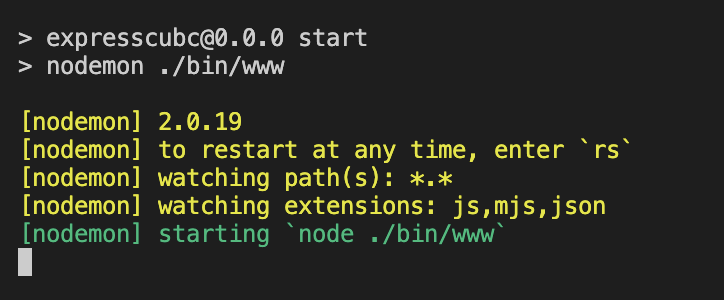
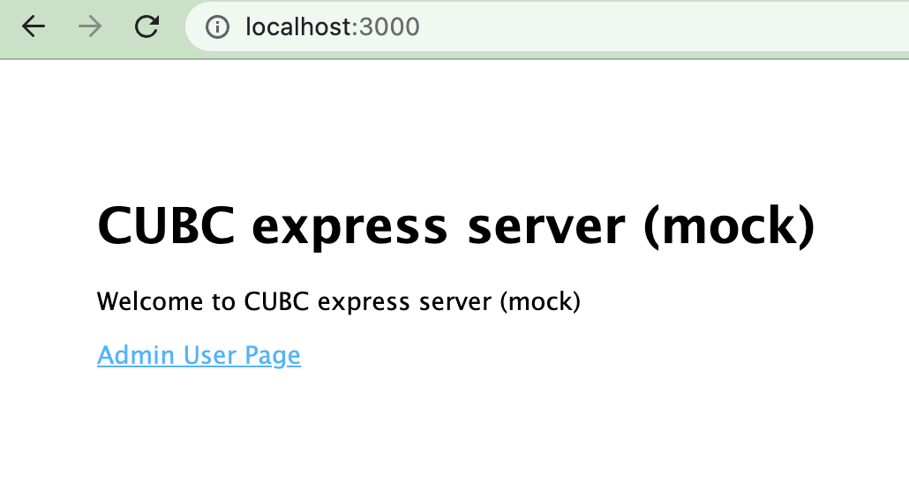

# Jetpack Comopse Mock server

## 啟動方式
### 安裝nodje
至官方下載安裝 https://nodejs.org/en/download/

### 安裝函式庫
* 進入git clone的目錄路徑
* 執行 ``` npm install  ```

### 執行Start npm run
執行 ``` npm start ``` 會出現如下方的提示


### 驗證是否啟動
#### 簡易方式：
打開browser```http://localhost:3000 ```可以看見如下圖


mac 執行
```
curl --location --request POST 'localhost:3000/api/auth/accessToken' \
--header 'Content-Type: application/json' \
--data-raw '{"apiId":"accessToken","deviceUUID":"caedc2cb-2686-4391-ad97-b12dedbbc0f7","txDateTime":"2022-09-13 00:53:26"}'
```

## 新增mock api
建議使用 vscode 可以方便編輯新增api
https://visualstudio.microsoft.com/zh-hant/downloads/